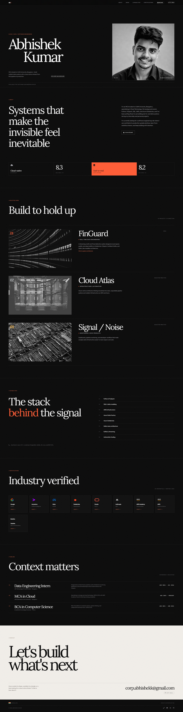
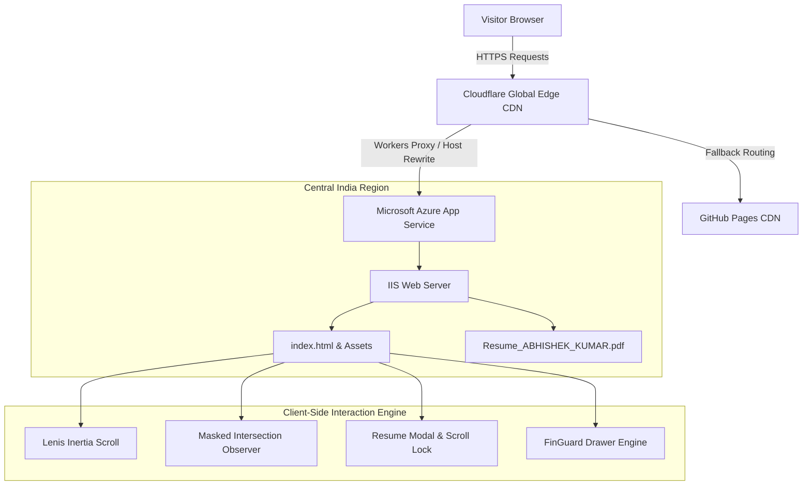

# Abhishek Kumar - Cloud & Data Engineering Portfolio

<div align="center">

[](https://isthatabbhi.tech)
[](https://isthatabbhi-argdfdguaaehbhax.centralindia-01.azurewebsites.net)
[](https://isthatabbhi.tech)
[](https://github.com/isthatabbhi/portfolio)

**An ultra-responsive, dark editorial engineering portfolio built for cloud, data, and distributed systems engineering.**

[Explore Live Portfolio](https://isthatabbhi.tech) | [FinGuard Deep Dive](https://github.com/isthatabbhi/FinGuard-Real-Time-Fraud-Detection) | [LinkedIn](https://linkedin.com/in/isthatabbhi) | [Contact](mailto:corp.abhishekk@gmail.com)

</div>

---

## Portfolio Overview

<div align="center">



</div>

---

## Table of Contents
1. [Design Philosophy and Approach](#design-philosophy-and-approach)
2. [Key Features and Functionalities](#key-features-and-functionalities)
3. [Technologies, Tools and Platforms](#technologies-tools-and-platforms)
4. [Architecture and Implementation Details](#architecture-and-implementation-details)
5. [Repository Structure](#repository-structure)
6. [Deployment Pipeline](#deployment-pipeline)
7. [Running Locally](#running-locally)
8. [Author and Contact](#author-and-contact)

---

## Design Philosophy and Approach

The portfolio is structured around a **dark editorial aesthetic** inspired by Swiss typography, architectural monographs, and brutalist engineering portfolios:

* **Pacing and Typography:** Pairs *Lora* (a literary editorial serif) with *Outfit* (a geometric modern grotesque sans-serif) and *JetBrains Mono* (a technical monospace font).
* **Kinetic Micro-Interactions:** Custom double-deck text rolls (`.roll-wrap`) on interactive elements that slide on hover with cubic-bezier inertia curves (`cubic-bezier(0.76, 0, 0.24, 1)`).
* **Masked Content Entrances:** Section headings and key metrics leverage masked overflow slide-ups driven by high-performance `IntersectionObserver` listeners.
* **Non-Obtrusive Film Grain:** A procedural SVG fractal noise overlay (`.grain`) adds subtle organic texture to the deep charcoal surfaces (`#0a0a0a` and `#121214`).
* **Zero Bloat Performance:** Built entirely with native web primitives with no heavy frontend frameworks (React/Vue/Angular), achieving sub-100ms First Contentful Paint (FCP).

---

## Key Features and Functionalities

| Feature | Description |
| :--- | :--- |
| **Inertia Smooth Scrolling** | Integrated **Lenis 1.2+** inertia scrolling engine with spring physics and custom curve interpolation for seamless mousewheel navigation. |
| **Micro Scroll Progress** | A 2px top-mounted progress bar (`#scroll-progress`) tracking document viewport scroll percentage via GPU-accelerated CSS transforms (`scaleX`). |
| **Interactive Resume Modal** | Embedded PDF viewer with custom toolbar controls, instant download action, and backdrop blur. Includes background scroll locking (`lenis.stop()`) and `Esc` key dismissal. |
| **FinGuard Architectural Drawer** | Slide-out technical drawer detailing real-time Medallion architecture (Bronze, Silver, Gold), PySpark streaming clusters, and Kafka ingestion topologies. |
| **One-Click Email Clipboard** | Async Clipboard API trigger with a floating status pill notification (`#toast`) upon copying `corp.abhishekk@gmail.com`. |
| **Standardized Verification Grid** | Responsive badge matrix with uniform logo constraints (`60px x 42px`) linking directly to credentials on Google, Meta, Databricks, Oracle, Anthropic, AWS, and Deloitte. |
| **Footer Auto-Fading Pill** | Floating "Top" navigation pill that automatically senses footer proximity via `IntersectionObserver` and fades out to prevent overlapping contact links. |

---

## Technologies, Tools and Platforms

### Frontend and Core
* **HTML5 and Semantic Markup:** Accessible landmarks, ARIA modal attributes, OpenGraph and Twitter card metadata.
* **Modern CSS3:** CSS Custom Properties (Design Tokens), CSS Grid, Flexbox, `clamp()` fluid typography, and backdrop blur filters.
* **JavaScript (ES6+):** Pure vanilla JavaScript with zero jQuery/React dependencies for minimal runtime overhead.
* **Lenis:** Smooth momentum scroll engine by Studio Freight.
* **Icons and Fonts:** FontAwesome 6 Pro, Google Fonts (`Lora`, `Outfit`, `JetBrains Mono`).

### Cloud Infrastructure and Hosting
* **Microsoft Azure App Service:** Deployed on Azure Cloud (Central India region) via automated ZIP deployment (`OneDeploy`).
* **Cloudflare Workers and Edge CDN:** Global reverse-proxy worker executing custom host-header rewrites, asset caching, and automated Universal SSL termination.
* **GitHub Pages and Git:** Version-controlled source code with automated edge deployment.
* **Custom Domain:** Configured on **`isthatabbhi.tech`** with HTTPS enforcement.

### Build and Automation Tools
* **Python 3:** `build_portfolio.py` orchestration script managing code generation, token synchronization, and minification.
* **PowerShell 7:** `deploy.ps1` automated packaging and one-command deployment script to Azure CLI (`az webapp deploy`).

---

## Architecture and Implementation Details



### Scroll and Modal Coordination
To prevent background page scrolling when reading the embedded resume or exploring the project drawer, a strict event isolation protocol is implemented:
```javascript
// Halt Lenis momentum scroll and lock document body
function openResumeModal() {
  resumeModalOverlay.classList.add('open');
  document.body.classList.add('modal-open');
  if (lenis) lenis.stop();
}

// Resume smooth scroll on modal dismissal
function closeResumeModal() {
  resumeModalOverlay.classList.remove('open');
  document.body.classList.remove('modal-open');
  if (lenis) lenis.start();
}
```

---

## Repository Structure

```text
├── assets/
│   ├── css/
│   │   ├── style.css             # Main stylesheet with design tokens and responsive layout
│   │   └── fontawesome-all.min.css # FontAwesome icons
│   ├── js/
│   │   └── main.js               # Lenis scroll engine, modal controllers, animations
│   └── webfonts/                 # Vector icon webfonts
├── images/
│   ├── portrait.png              # High-contrast monochromatic hero portrait
│   ├── screenshots/              # High-resolution portfolio walkthrough screenshots
│   │   ├── 01-hero-editorial.png
│   │   ├── 02-about-and-signals.png
│   │   ├── 03-selected-work.png
│   │   └── 04-certifications-timeline.png
│   └── logos/                    # Verified company logos (Google, AWS, Meta, etc.)
├── Resume_ABHISHEK_KUMAR.pdf     # Official verified resume document
├── index.html                    # Single-page semantic portfolio document
├── web.config                    # Microsoft IIS web server configuration
└── README.md                     # Project documentation and technical guide
```

---

## Deployment Pipeline

### Automated 1-Click Azure Deployment
The portfolio uses an automated PowerShell deployment script that compresses the project directory and invokes Azure's `OneDeploy` sync API:

```powershell
# Run from repository root
.\deploy.ps1
```

### Step-by-Step Deployment Flow:
1. **Source Sync:** `build_portfolio.py` updates HTML, CSS design tokens, and JavaScript modules.
2. **Packaging:** Compresses `portfolio/` into `abhishek_kumar_portfolio.zip`.
3. **Azure OneDeploy:** Invokes `az webapp deploy --name isthatabbhi --resource-group RG-PORTFOLIO`.
4. **Edge Invalidation:** Cloudflare Edge automatically caches and delivers static assets globally.

---

## Running Locally

To run and preview the portfolio locally:

1. **Clone the repository:**
   ```bash
   git clone https://github.com/isthatabbhi/portfolio.git
   cd portfolio
   ```

2. **Start a local HTTP server:**
   ```bash
   # Using Python
   python -m http.server 8000

   # Or using Node.js / npx
   npx serve .
   ```

3. **Open in browser:**
   ```text
   http://localhost:8000
   ```

---

## Author and Contact

**Abhishek Kumar**  
*Cloud, Data & Software Engineering*  
*MCA in Cloud Technology - JAIN (Deemed-to-be-University), Bengaluru*

* **Live Website:** [https://isthatabbhi.tech](https://isthatabbhi.tech)
* **LinkedIn:** [linkedin.com/in/isthatabbhi](https://linkedin.com/in/isthatabbhi)
* **GitHub:** [github.com/isthatabbhi](https://github.com/isthatabbhi)
* **Email:** [corp.abhishekk@gmail.com](mailto:corp.abhishekk@gmail.com)
* **Phone:** +91 8340172491

---

<div align="center">
  <sub>Built with intention, resilience, and attention to detail. (c) 2026 Abhishek Kumar.</sub>
</div>
